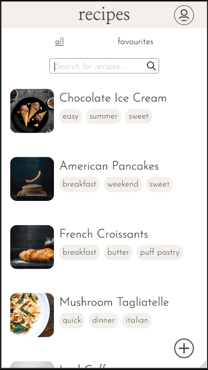

<div align="center">
  
</div>

---

## Get Cooking

Not matter whether your're a pro or an absolute beginner at cooking 'get cooking' will become your best friend in the kitchen. You can easily bookmark your favourite recipes that were created by members of the community and also create and submit your own recipes which in turn might inspire others to try out new recipes.

This app was developed as my capstone project during the final four weeks of the neuefische Web Development Bootcamp in May, 2020.

This app was developed and optimized for mobile useage, so please switch your browser to responsive mode (iPhone 6/7/8)

Take a look at the get cooking app [here](https://get-cooking.web.app/)

<div align="center">
  
       
       
       
       
</div>

---

## Tech stack, dependencies and all the good stuff I used
- react
- react-router
- react-hooks
- styled-components
- storybook
- jest
- react-testing-library
- cypress
- local storage
- firebase
  - storage
  - firestore
  - hosting
  - authentication

---

## Want to set it up?
- clone this repository
- install all npm dependencies   
    ```npm install```
- as the app is based on firebase firestore and storage you need to install Firebase    
 ```npm install -g firebase-tools```    
 and intialize it to use and deploy your firebase project.
- For more information check out the [firebase documentation](https://firebase.google.com/docs).
- Run Storybook   
```npm run storybook```  
- Run React Testing Library & Jest
```npm test```
- Run Cypress   
```npm run cypress```
___

## Last But Not Least
Big shoutout to the lovely team [@neuefische](https://neuefische.de/) in Hamburg and of course all my classmates of w2 2020!
