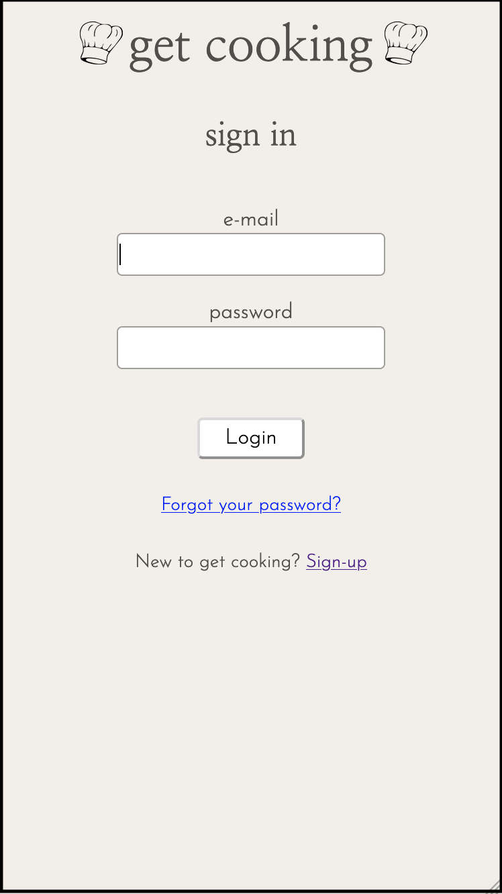
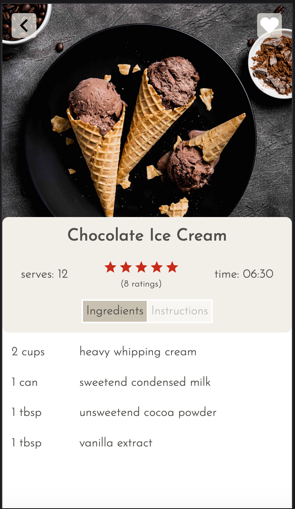
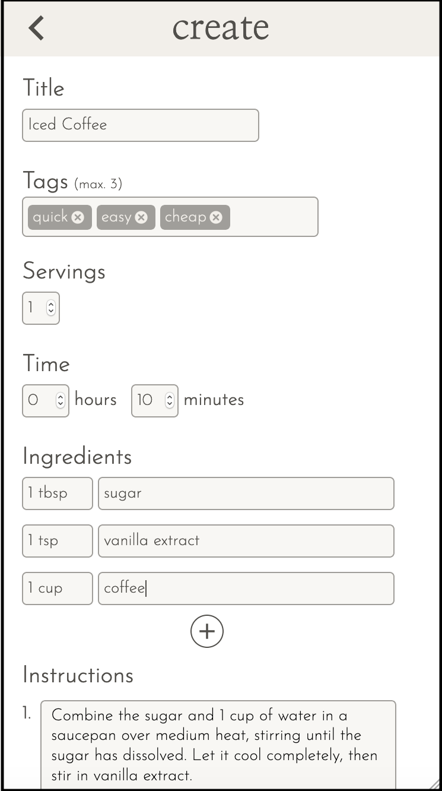
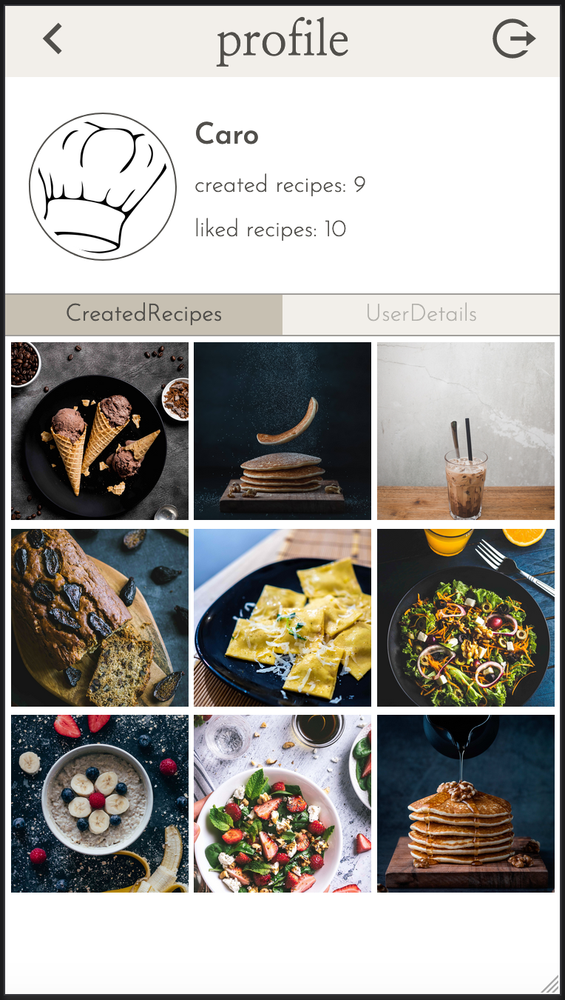

<div align="center">
  
</div>

---

## Get Cooking

No matter whether your're a pro or an absolute beginner at cooking, 'get cooking' will become your best friend in the kitchen. You can easily bookmark your favourite recipes that were created by members of the community and also create and submit your own recipes which in turn might inspire others to try out new recipes.

This app was developed as my capstone project during the final four weeks of the neuefische Web Development Bootcamp in May, 2020.

This app was developed and optimized for mobile usage, so please switch your browser to responsive mode (iPhone 6/7/8)

Take a look at the get cooking app [here](https://get-cooking.web.app/)   
If you don't want to create a new account you can sign in with these credentials:   
email: stuhr.test@googlemail.com   
pw: capstone123

---

## Some impressions of the app

<div align="center">
  
</div>
<div align="center">
  
  
</div>
<div align="center">     
  
  
  
</div>

---

## Tech stack, dependencies and all the good stuff I used
- react
- react-router
- react-hooks
- styled-components
- storybook
- jest
- react-testing-library
- cypress
- local storage
- firebase
  - storage
  - firestore
  - hosting
  - authentication

---

## Want to set it up?
- clone this repository
- install all npm dependencies   
    ```npm install```
- this app uses firebase storage and firestore, therefore you need to install firebase    
 ```npm install -g firebase-tools```    
 and intialize it to use and deploy the firebase project.
- For more information check out the [firebase documentation](https://firebase.google.com/docs).
- to run Storybook   
```npm run storybook```  
- to run React Testing Library & Jest   
```npm test```
- to run Cypress   
```npm run cypress```
___

## Last But Not Least
Big shoutout to the lovely team [@neuefische](https://neuefische.de/) in Hamburg for all the support they have given me and of course all my classmates of w2 2020!
